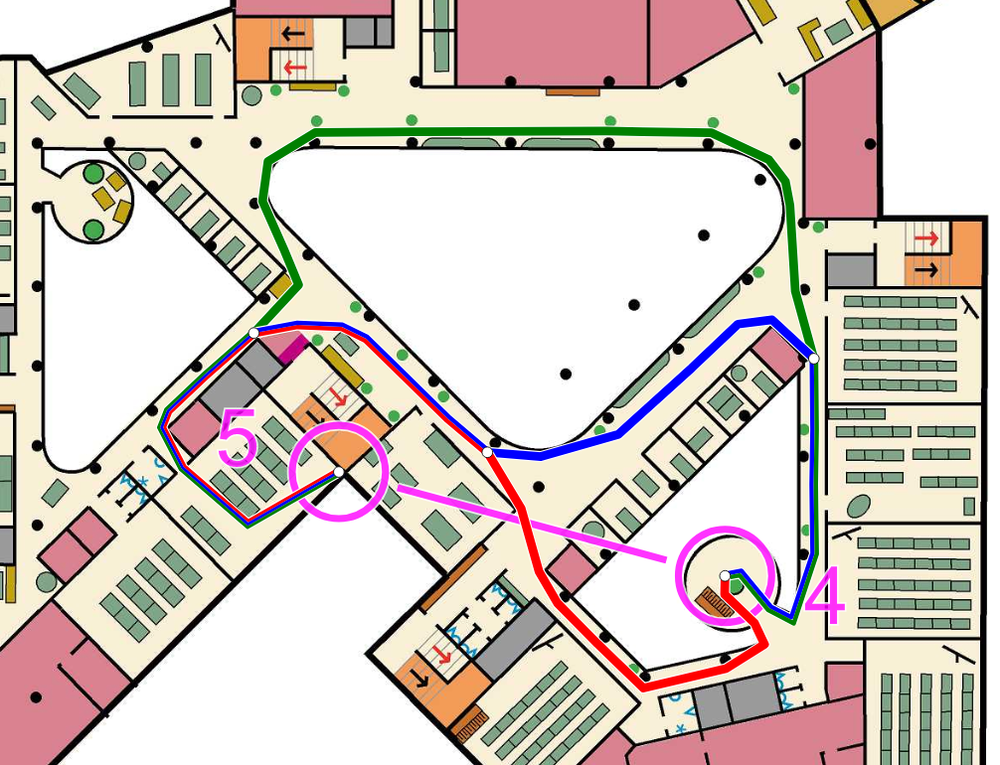

# via-indoor-analysis

A route choice analysis tool for indoor sprint orienteering developed for a competition at VIA University College Horsens in March 2024.
The route choices are not drawn manually, but are instead computed based on a graph representation of the map and courses.


## Usage

The tool is focused around a view of the map, and presents different interactions and displays different data depending on the selected mode.
The modes include the main `View` and `Edit` modes, as well as a few submodes under the `Edit` mode.

The interface is available in both Danish and English, and a language switcher is located in the top right.


### View

The `View` mode is the primary mode for end users, including, but not limited to, curious participants of the competition.
Users can select a course and cycle through its legs.
For the selected leg, the relevant route choices are drawn on the map and listed in the control pane.
In the list, the route choices are sorted by distance in ascending order, with their rank, colour, distance and elevation gain shown.
Route choices can be highlighted on the map by selecting them in the list.


### Edit

The `Edit` mode is intended for the organiser to use.
Here, the underlying graph representation is incrementally defined when working through the different submodes.
`Edit` mode is only available on the desktop version.

#### Points

The first `Edit` submode is used to define the positions and types of points on the map.
In computer science terminology, these points are also known as *nodes* or *vertices*.

Points are placed by clicking on the map, and a point can be deleted by shift-clicking on it.

The position of a point is defined in three dimensions.
The horisontal coordinates `x` and `y` are determined from the position of the mouse click used to create the point.
The vertical `z` coordinate is specified with a numeric input in the control pane, and it represents the height of a point in whole building floors.

The type of point to place is selected in the control pane.
There are five different types to choose from:
`Guide`, `Waypoint`, `Control`, `Start` and `Finish`.

The last three should be familiar from regular orienteering courses, as they are used to define the courses - more on that in a bit.
Their positions should reflect those chosen by the course setter for the "real" courses.
The other two point types are more specific to this project.

`Waypoints` are used to distinguish between different choices, i.e. different stairways or hallways, or different ways around major obstacles.
They are drawn with red circles in the editor.
For performance reasons, their use should be kept to a meaningful minimum.

`Guides` are used to connect different `Waypoints` together in realistic fashion.
They do not define a distinct choice, but they *do* ensure that paths between `Waypoints` go *around* walls, pillars and so on.
`Guides` are drawn with blue circles in the editor.

#### Connections

To form the graph structure, points should be connected together.
These connections are also known as *edges*, *links* or *lines* in computer science terminology.
All connections are *undirected* in the current implementation, i.e. direction of travel along a connection is not restricted.

Right-clicking on a point selects that point, highlighting its connections.
A new connection can then be made by left-clicking on another point.
Shift-clicking is used to delete a connection instead.

Connections define what movement is possible between points.
They should only be made where participants are able to go in real life - so not through walls, across large gaps and so on.
Furthermore, a point should only be connected to the closest other point within line of sight in any given direction.
Colinear and overlapping connections should therefore be avoided, with a preference towards daisy-chaining points together instead.

Two types of connections are available, differing in how distances are calculated along them.
In most cases, the normal type is appropriate, and distances along such connections are calculated based on their relative positions.
However, a "portal" connection type is also available.
Portal connections link two points together as if they were the same, meaning the horisontal distance between them is fixed at 0 regardless of their positions on the map.
This is useful for stairs, since the different floors are drawn alongside each other to accommodate the two-dimensional nature of printed maps.

#### Courses

Courses consist of one `Start` point, one `Finish` point, and any number of `Control` points between them.
Multiple courses can be defined, and their names can be changed at any time.

Points are added by clicking on them on the map.
Clicking on a `Start` or `Finish` point sets that point as the start or finish of the course, respectively.
Clicking on a `Control` point appends it to the list of controls, placing it right before the finish in the sequence.
However, if a `Control` point is selected, which can be done by right-clicking it, controls are instead added after the selected control.

The same `Control` point can appear multiple times on the same course, but not consecutively.
Removing a control from the current course is done by shift-clicking it.
Should the control be included more than once, only the last instance is removed.

#### Calculations

There is not much to do in this submode - at least not manually.
A press of the `Calculate` button runs all path finding required for the defined courses.
On the included example, this takes a couple seconds on a relatively modern desktop CPU.
Reflecting the underlying algorithm, the calculation results can be viewed in two ways: `Paths` or `Legs`.

When viewing `Paths`, all points and connections are visible.
Unused connections are gray, while used connections are blue.
Selecting a `Waypoint`, `Control`, `Start` or `Finish` point will additionally highlight the shortest path from that point to each neighbouring point of those types.

If instead viewing `Legs`, the computed route choices between any two `Control`, `Start` or `Finish` points can be shown by selecting them.
Not all combinations are calculated, however.
Only route choices relevant for the defined courses are found.

#### Files

A JSON representation of the current state, including points, connections and courses, can be downloaded (and later imported) from the `Files` submode.
Applying imported data overwrites the current state and runs path finding calculations with the new data.

An example made for the real event that the tool was made for is automatically imported and computed at page load.
Reloading the page therefore restores the state to this example.


## Implementation

The source code is of course available for anyone to see, but here are a few quick notes on the most interesting parts of the implementation.


### Path finding

When it comes to path finding, the bulk of the heavy lifting is done by Dijkstra's algorithm and, at one stage, a modified version of Yen's algorithm.

Here and in the code, a distinction is made between "paths" and "routes".

A path consists of a series of unique, connected points.
A completed path contains two `Waypoints`:
one at the start, and one at the end.
Between them, any number of `Guide` points may be included.

A route consists of a series of unique `Waypoints`, each connected to the next with a path.
Similar to paths, a completed route contains two `Control`, `Start` or `Finish` points:
one at the start, and one at the end, with any number of `Waypoints` between them.

Path finding is split into multiple stages.
Stages 1 and (especially) 2 are computationally intense.
These stages are run when the `Calculate` button is pressed, and when saved state is applied (i.e. at page load and state import).
Stage 3 is much faster to compute, and is run for a single leg when that leg is selected.

#### Stage 1: Paths between waypoints

> Implemented in [`src/lib/pathfinding/build-paths.ts`](src/lib/pathfinding/build-paths.ts).

Strictly speaking, it is not necessary to distinguish between `Guides` and `Waypoints`, but they provide a layer of abstraction on top of the graph as a whole.
This greatly simplifies decision making when finding route choices, significantly reducing computation time.

In this first stage, an algorithm is performed for every `Waypoint`:
Using Dijkstra's algorithm, the graph is searched from this "origin" `Waypoint`, iterating through every connected `Guide`.
This continues down the connection chain until another `Waypoint` is found, at which point a path is saved, and this particular branch of the search ends.

At the end of the search, every possible path from the origin `Waypoint` to (but not through) its "neighbouring" `Waypoints` has been found.
Only the shortest path to each neighbour is kept.

#### Stage 2: Routes between controls

> Implemented in [`src/lib/pathfinding/build-routes.ts`](src/lib/pathfinding/build-routes.ts).

Stage 2 is similar to stage 1, but this time, the abstraction level of the graph is raised one step up.
Rather than finding the single shortest path through `Guides` between `Waypoints`, the aim now is to find routes through `Waypoints` between `Controls`, `Starts` and `Finishes`, including both the single shortest route, but also a variety of alternate routes.

Stage 2 is performed once for every leg in the defined courses.

##### Stage 2a: Shortest route choice

In stage 2a, Dijkstra's algorithm is utilised once again.
The search now originates at a `Control` or `Start`, and through the paths found in stage 1, the single shortest route to another `Control` or to a `Finish` is found.

##### Stage 2b: Alternate route choices

In stage 2b, alternate routes are found, as comparing different route choices is commonly of interest in orienteering.

For this stage, a modified version of Yen's algorithm is used, with Dijkstra's algorithm *again* used for the underlying graph traversal.

With Yen's algorithm, variants of the route from stage 2a are created.
These variants follow the original route for a certain number of paths, after which point they are forced to diverge (without backtracking).
The remaining route is then computed as usual, save for the excluded path that the original route followed at the diversion point.
A full set of variants is created, each diverging at a different path in the original route.
The shortest variant is then stored alongside the original, and the *two* shortest routes have then been found.

To find more variants, this stage is repeated, but referencing the most recently stored route instead of the shortest route.
Along the way, the new variants are compared to all the stored routes to ensure *different* variants are found.

Conventionally, Yen's algorithm terminates once a certain number of alternate routes have been found (or when no more alternatives *can* be found).
However, no fixed number of alternate routes can be chosen here, so instead, termination depends on the *distance* of the newly-found alternative route.
In this case, the algorithm is halted when the shortest new variant is more than twice the distance of the shortest route.

Another modification is that, rather than only storing the shortest variant and purging *all* others between iterations, only *some* of the leftover variants are purged, with the shortest 40% kept in the temporary pool for comparison against the next variants.
The shortest of these leftover variants is then stored in the *next* iteration if all the new variants are longer.
The effect is that a few additional (interesting) alternate routes, which otherwise would be discarded, are stored, though this comes at a severe performance penalty:
the vast majority of computation time is spent here, because the pool of variants takes much longer to deplete in this implementation than with the standard version of Yen's algorithm.

#### Stage 3: Filtering

> Implemented in [`src/lib/pathfinding/pick-routes.ts`](src/lib/pathfinding/pick-routes.ts).

Not all routes found in stage 2b are interesting.
Most of them include meaningless detours that no human would ever deliberately take,
while others may be needlessly complex, e.g. changing floors without the slightest hint of benefit.
To address this, routes are filtered before being shown to the user.

When filtering alternative routes for a leg, up to two routes are kept unconditionally:
the absolute shortest route, and the shortest route among the routes with the least elevation gain.
"Up to" two, because the absolute shortest route often also has the least elevation gain, though not *always*.
Beyond this, filtering is carried out in multiple steps.

#### Stage 3a: Exclude duplicates

The first filter is very straightforward:
duplicates are excluded.
If two "different" routes contain the same points in the same order, they are obviously redundant, and only one should be kept.

#### Stage 3b: Exclude outliers by distance

If most of the route variants are close in distance, but a few are significantly longer than the rest, chances are good that these outliers represent nonsensical route choices.

To detect this, the median distance of the variants are found, and any variants exceeding a certain threshold relative to the median distance are discarded.
This threshold is set to 1.2, or 120% of the median distance.

#### Stage 3c: Exclude basic detours

What might in some cases present a meaningful obstacle or an interesting decision may in other cases be nothing more than an intuitive formality.

To put this into perspective, consider a road junction from the view of a pedestrian.
Crossing from one corner to an adjacent corner is trivial:
just cross the one road between them.
However, it is also possible to reach the same corner by going the *other* way around the junction, crossing the other three roads instead, but this is obviously a meaningless detour.

To detect such detours, the `Waypoints` of alternate routes are compared:
If e.g. route A contains every `Waypoint` from route B in the same order, but then also contains one or more additional `Waypoints`, route A is discarded.

#### Stage 3d: Filter by distance

The gist of this filter is that excessively long routes are discarded, but with more leeway if a long route has *less* elevation gain than the shortest route, and, of course, with *less* leeway in the opposite case.

Comparison of a `route` to the `shortest_route` on the same leg uses their elevation gains and distances, as well as a baseline `threshold`, which much be at least 1 - it is fixed to 1.7 in the implementation.

Based on these parameters, an `weighted_threshold` is calculated to account for differences in elevation gain:

```math
{weighted\_threshold}={{1}+{{\left({{threshold}-{1}}\right)}^{{\left({d}\right)}^{2}}}}
```

... where `d` is the following:

```math
{d}={\frac{{1}+{route.elevation\_gain}}{{1}+{shortest\_route.elevation\_gain}}}
```

This `weighted_threshold` is then used when comparing the distance of the `route` to that of the `shortest_route`, discarding the `route` if the following inequality is false:

```math
{route.distance}<{{weighted\_threshold}\cdot{shortest\_route.distance}}
```

For this consideration, the "mandatory distance" is excluded.
A route may contain mandatory distance if one or both of the `Controls` it connects are located at dead ends in the graph.
For such `Controls`, a portion of the route necessarily has *no* decisions whatsoever, meaning some of its distance is mandatory.

#### Stage 3e: Filter by sameness

Usually, most of the route variants on a given leg have a lot of overlap, meaning their comparatively trivial differences mostly serve as clutter, obscuring the more interesting variations.
While the filtering in stage 3c takes care of the most egregious cases, more sophisticated filtering is still required.
Indeed, this is the most complex filter of them all.

In essence, a route with too much overlap with any shorter route on the same leg is discarded, with less leeway provided on a few conditions, proportional to the "offence":

- Routes with more elevation gain than the shortest route.
- Routes that are longer than the shortest route.
- Legs where the shortest route is very short.

To elaborate on the third condition, it is worth noting that the general distance threshold is set relatively high to accommate route choices on the hardest legs.
For these, the shortest route choice may be *significantly* shorter than the others, but also much more complex to identify and execute, meaning *some* fairly long alternatives are still interesting to compare against.
However, on very short legs, a stricter distance threshold would be an advantage, since their routes tend to be much less complex.
For those, the longest route choices within the high threshold will often appear very obviously poor.
Still, in a few cases, it may be desirable to compare distinctly different route choices, even if one is quite a bit longer than the other, so this skewed distance filtering needs to be a part of the sameness filter rather than the general distance filter.

When iterating over the route variants to apply this filter, the `current_route` is compared against each `shorter_route` in the pool.

To determine `sameness`, the `shared_distance` between the two routes is calculated:
when two consecutive points in the `current_route` are also used in the same order in the `shorter_route`, the distance between them contributes to the `shared_distance`.
The `sameness` of the `current_route` relative to the `shorter_route` is then calculated as follows:

```math
{sameness}={\frac{shared\_distance}{shorter\_route.distance}}
```

The `sameness` of the `current_route` is compared against two thresholds, and if *either* threshold is exceeded, the `current_route` is discarded.

The first threshold, `max_sameness`, is a fixed upper limit on `sameness`, which is set to 0.5 in the implementation, meaning no more than 50% overlap is permitted.

The second threshold, `weighted_max_sameness`, is where the complexity of the filter is expressed.
It depends on three derived parameters:
`detour_ratio`, `extra_elevation_gain` and `short_leg_detour_penalty`.
These parameters attempt to describe how much worse the `current_route` is compared not to the `shorter_route`, but to the optimal `shortest_route` on the leg.

The `detour_ratio` describes the relative distance of the `current_route` versus the distance of the `shortest_route`:

```math
{detour\_ratio}={\frac{current\_route.distance}{shortest\_route.distance}}
```

The `extra_elevation_gain` is how much *more* elevation gain (in whole floors) the `current_route` has compared  to the `shortest_route`, or 0 if it has the same or less elevation gain.

The `short_leg_detour_penalty` is calculated from a list of distance thresholds (this time being absolute distance rather than relative) and the distance of `shortest_route`.
For how many times each distance threshold is greater than the shortest route (rounded down), the `short_leg_detour_penalty` is increased by 1.
If the distance of the shortest route is 25 m, then a distance threshold of 40 would add 1 to the `short_leg_detour_penalty`, while a distance threshold of 50 would add 2.
The implementation does indeed use distance thresholds of 40 and 50.

The `weighted_max_sameness` is then calculated according to the following expression:

```math
{weighted\_max\_sameness}={{0.95}^{\left({{1.3}\cdot{\mathrm{{\:\mathrm{powSelf}}}{\left({{detour\_ratio},\:{n}}\right)}}}\right)}}
```

... in which the argument `n` involves the `extra_elevation_gain` and `short_leg_detour_penalty` like so:

```math
{n}={{{1}+{{2}\cdot{extra\_elevation\_gain}}}+{{2}\cdot{short\_leg\_detour\_penalty}}}
```

... and the function `powSelf` is implemented in a way to *very* aggressively scale the `detour_ratio`:

```ts
function powSelf(x: number, n: number)
{
    for (let i = 0; i < n; i++)
    {
        x = x ** x;
    }

    return x;
}
```

The effect is that the `weighted_max_sameness` (and thus the permitted amount of overlap between the `current_route` and the `shorter_route`) becomes very low when one or more of the three aforementioned conditions (more elevation gain, more distance, short leg) are met.

In other words, alternate routes are limited in how much overlap they can have with other (shorter) routes, and they are *especially* limited when, compared to the *shortest* route on the leg, they are much longer or have more elevation gain, or when the leg as a whole is very short.

As in stage 3d, "mandatory distance" is excluded from these considerations.

#### Stage 3f: Exclude crossover detours

The final filter is intended to catch a few instances of an edge case, where an intuitively poor route choice slips through the filters by virtue of being just different enough from the other routes - at least when compared to each in isolation - without adding *too* much distance.

Specifically, if route A follows route B for some distance, then diverges and later follows route C, then route A may evade the sameness filter by sharing with *different* routes.
If route A is then also longer than both B and C, then hopping between B and C is unlikely to be a good route choice, and route A is discarded.


## Licensing

The orienteering map of VIA University College Horsens, both in full at [`static/via-map.jpg`](static/via-map.jpg) and partially at [`example.png`](example.png), is under copyright belonging to [Horsens Orienteringsklub](https://horsensok.dk/) as detailed in [LICENSE.via-map.md](LICENSE.via-map.md).
The map is not licensed to outside parties.

The rest of the `via-indoor-analysis` repository is licensed under the copyleft [GNU AGPLv3](https://www.gnu.org/licenses/agpl-3.0.html) or any later version. The full license text is included in [LICENSE.md](LICENSE.md).
